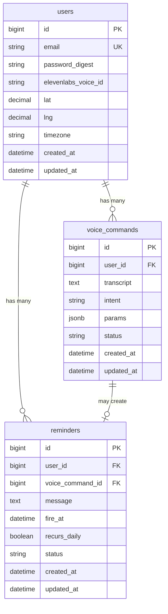

# feat: Build browser-based Voice Assistant Rails App

## Overview

A multi-user Rails 8 voice assistant. Users press spacebar to record a command; audio is transcribed by Deepgram, parsed by a regex command engine, and answered via ElevenLabs TTS. Immediate commands (time, sunset) respond in the same request. Delayed commands (timers, reminders) are scheduled via Sidekiq and delivered to the open browser tab through Turbo Streams over Action Cable.

(see brainstorm: docs/brainstorms/2026-02-23-voice-assistant-brainstorm.md)

---

## Problem Statement

The `florance` project is a working single-user prototype of this concept, but its entire UI runs as a 538-line inline `<script>` block with no auth, no persistence for reminders, and client-side `setTimeout` for timers (lost on page reload). `voice_assistant` promotes this to a proper multi-user Rails application with server-side scheduling, proper Hotwire architecture, and full TDD discipline.

---

## Proposed Solution

Implement in five phases:

1. **Foundation** — generate the Rails app, configure gems, auth, Action Cable, Sidekiq
2. **Services layer** — extract API clients and command parser from the `florance` prototype
3. **Immediate commands** — time check, sunset (synchronous request/response)
4. **Delayed commands** — timer, one-time reminder, daily reminder (Sidekiq + Turbo Streams)
5. **Per-user settings** — voice ID, lat/lng for sunset

---

## Database Schema (ERD)



**Notes:**
- `voice_commands.intent` — enum string: `time_check`, `sunset`, `timer`, `reminder`, `unknown`
- `voice_commands.params` — jsonb storing intent-specific data (e.g., `{minutes: 10}`, `{message: "write morning pages", daily: false}`)
- `voice_commands.status` — `received`, `processed`, `scheduled`, `failed`
- `reminders.status` — `pending`, `delivered`, `cancelled`
- `users.lat` / `users.lng` — stored for per-user sunset calculation; can be updated in settings
- `users.timezone` — IANA timezone string (e.g. `"America/New_York"`); set from browser `Intl.DateTimeFormat().resolvedOptions().timeZone` at registration; used to interpret "7am" in reminder scheduling

---

## Architecture Flow

```
Spacebar keydown → MediaRecorder starts recording
Spacebar keyup → MediaRecorder stops → audio blob ready
  → POST /voice_commands (multipart: audio file)
  → VoiceCommandsController#create
      → DeepgramClient#transcribe(audio) → transcript string
      → CommandParser#parse(transcript) → {intent:, params:}
      → VoiceCommand.create!(user:, transcript:, intent:, params:, status: "processed")
      → CommandResponder#call(intent:, params:, user:)
          → Immediate path: response_text → ElevenLabsClient#synthesize(text:, voice_id:)
                            → send_data audio_bytes, type: "audio/mpeg"
          → Delayed path:   Reminder.create!(user:, message:, fire_at:, recurs_daily:)
                            → ReminderJob.perform_at(fire_at, reminder.id)
                            → confirmation_text (e.g. "Timer set for 10 minutes")
                            → ElevenLabsClient#synthesize(confirmation_text)
                            → send_data audio_bytes, type: "audio/mpeg"

──── Later, when ReminderJob fires ────

ReminderJob#perform(reminder_id)
  → reminder = Reminder.find(reminder_id)
  → text = build_response_text(reminder)
  → audio = ElevenLabsClient#synthesize(text:, voice_id: reminder.user.elevenlabs_voice_id)
  → Store audio bytes with one-time token in Rails.cache (TTL: 5 minutes)
  → Turbo::StreamsChannel.broadcast_append_to(
        reminder.user,
        target: "voice_alerts",
        partial: "voice_alerts/alert",
        locals: { token: token }
      )
  → reminder.update!(status: "delivered")
  → reschedule if recurs_daily

──── Browser receives Turbo Stream ────

<div data-controller="voice-alert" data-voice-alert-token-value="TOKEN">
Stimulus VoiceAlertController#connect()
  → fetch GET /voice_alerts/TOKEN → audio bytes
  → play via Web Audio API
  → element.remove()
```

---

## Technical Approach

### Phase 1: Foundation

**Generate the app (targeting existing directory):**

```bash
# app already scaffolded; run from parent:
rails new voice_assistant --database=postgresql --asset-pipeline=propshaft \
  --javascript=importmap --skip-test --skip-action-mailbox --skip-action-text \
  --force
```

**Gems to add to Gemfile:**

```ruby
gem "sidekiq"
gem "redis"
gem "bcrypt"            # already present but commented out in florance

group :development, :test do
  gem "rspec-rails"
  gem "factory_bot_rails"
end

group :test do
  gem "mutant-rspec"
end
```

**Key configuration:**

- `config/application.rb` — ensure `require "action_cable/engine"` is active
- `config/cable.yml` — Redis adapter (shared with Sidekiq; async in dev)
- `config/initializers/sidekiq.rb` — `Sidekiq::Web` mount + Redis URL
- `config/mutant.yml` — per CLAUDE.md spec
- `config/database.yml` — PostgreSQL

**Auth (session-based, `has_secure_password`):**

```ruby
# app/models/user.rb
class User < ApplicationRecord
  has_secure_password
  validates :email, presence: true, uniqueness: true, format: { with: URI::MailTo::EMAIL_REGEXP }
end
```

```ruby
# app/controllers/application_controller.rb
def current_user
  @current_user ||= User.find(session[:user_id]) if session[:user_id]
end
helper_method :current_user

def require_authentication
  redirect_to sign_in_path unless current_user
end
```

**Action Cable connection (identifies current_user for scoped streams):**

```ruby
# app/channels/application_cable/connection.rb
module ApplicationCable
  class Connection < ActionCable::Connection::Base
    identified_by :current_user

    def connect
      self.current_user = find_verified_user
    end

    private

    def find_verified_user
      User.find(cookies.signed[:user_id]) || reject_unauthorized_connection
    end
  end
end
```

*Note:* Session-based auth uses `cookies.signed[:user_id]` — set this alongside `session[:user_id]` in `SessionsController#create`.

---

### Phase 2: Services Layer

All services live in `app/services/`. Keyword arguments on `#call`. Thin wrappers around `Net::HTTP` (no Faraday needed — proven pattern in `florance`).

**`app/services/deepgram_client.rb`**

```ruby
class DeepgramClient
  ENDPOINT = "https://api.deepgram.com/v1/listen"
  PARAMS = "model=nova-2&punctuate=true&smart_format=true"

  def transcribe(audio_data:, mime_type: "audio/webm")
    # POST audio bytes to Deepgram REST API
    # Returns transcript string or raises DeepgramError
  end
end
```

Reference: `florance` uses the WebSocket approach for streaming; for spacebar-record UX we use the simpler REST upload endpoint instead.

**`app/services/elevenlabs_client.rb`**

```ruby
class ElevenLabsClient
  BASE_URL = "https://api.elevenlabs.io/v1/text-to-speech"

  def synthesize(text:, voice_id:)
    # POST to ElevenLabs, model: "eleven_multilingual_v2"
    # Returns raw audio bytes (audio/mpeg)
    # Raises ElevenLabsError on failure
  end
end
```

Reference: `florance/app/controllers/time_check_controller.rb:50-69` has the working HTTP call.

**`app/services/sunrise_sunset_client.rb`**

```ruby
class SunriseSunsetClient
  BASE_URL = "https://api.sunrise-sunset.org/json"

  def sunset_time(lat:, lng:)
    # GET sunrise-sunset.org, parse sunset UTC, convert to local
    # Returns Time object
  end
end
```

Reference: `florance/app/controllers/time_check_controller.rb:14-31`.

**`app/services/command_parser.rb`**

```ruby
class CommandParser
  # Deepgram transcribes spoken numbers as words ("ten minutes"), not digits.
  # Normalize before regex matching.
  WORD_NUMBERS = {
    "one" => 1, "two" => 2, "three" => 3, "four" => 4, "five" => 5,
    "six" => 6, "seven" => 7, "eight" => 8, "nine" => 9, "ten" => 10,
    "eleven" => 11, "twelve" => 12, "thirteen" => 13, "fourteen" => 14,
    "fifteen" => 15, "twenty" => 20, "thirty" => 30, "forty" => 40,
    "forty-five" => 45, "sixty" => 60,
  }.freeze

  PATTERNS = {
    time_check:     /\btime\b/i,
    sunset:         /\bsunset\b/i,
    timer:          /\btimer\s+(?:for\s+)?(\d+)\s+minute/i,
    daily_reminder: /\bdaily\s+(\d{1,2})(?::(\d{2}))?\s*(?:am|pm)\s+reminder\s+(?:to\s+)?(.+)/i,
    reminder:       /\b(\d{1,2})(?::(\d{2}))?\s*(?:am|pm)\s+reminder\s+(?:to\s+)?(.+)/i,
  }.freeze

  # Normalizes spoken number words to digits, then matches patterns.
  # Returns {intent: :time_check, params: {}} or {intent: :unknown, params: {}}
  def parse(transcript)
    normalized = normalize_numbers(transcript)
    # Match patterns in priority order, extract params
  end

  private

  def normalize_numbers(text)
    WORD_NUMBERS.reduce(text) { |t, (word, digit)| t.gsub(/\b#{word}\b/i, digit.to_s) }
  end
end
```

**`app/services/command_responder.rb`**

```ruby
class CommandResponder
  def call(intent:, params:, user:, voice_command:)
    case intent
    when :time_check      then handle_time_check
    when :sunset          then handle_sunset(user:)
    when :timer           then handle_timer(params:, user:, voice_command:)
    when :reminder        then handle_reminder(params:, user:, voice_command:, daily: false)
    when :daily_reminder  then handle_reminder(params:, user:, voice_command:, daily: true)
    else                       handle_unknown
    end
  end
end
```

All paths return `{type: :immediate, audio: <bytes>}` — including scheduled commands which speak a confirmation (e.g. "Timer set for 10 minutes", "Reminder set for 7 AM"). This keeps the controller uniform: always `send_data` audio.

---

### Phase 3: Immediate Commands

**`app/controllers/voice_commands_controller.rb`**

```ruby
class VoiceCommandsController < ApplicationController
  before_action :require_authentication

  def create
    audio_data = params.require(:audio).read
    transcript = DeepgramClient.new.transcribe(audio_data:)
    parsed     = CommandParser.new.parse(transcript)
    command    = VoiceCommand.create!(
      user: current_user,
      transcript:,
      intent: parsed[:intent],
      params: parsed[:params],
      status: "received"
    )
    result = CommandResponder.new.call(
      intent: parsed[:intent],
      params: parsed[:params],
      user: current_user,
      voice_command: command
    )
    command.update!(status: "processed")

    send_data result[:audio], type: "audio/mpeg", disposition: "inline"
  end
end
```

**`app/javascript/controllers/voice_controller.js`** (Stimulus)

```js
// Values: recordingValue (boolean)
// Targets: statusTarget (text display)
// MAX_DURATION_MS = 15_000 (enforce in startRecording; auto-stop at limit)

// connect() — bind keydown/keyup listeners on document
// handleKeydown(e) — guard: skip if e.target is INPUT/TEXTAREA/SELECT; skip if already recording
// startRecording() — MediaRecorder.start(); set 15s auto-stop timeout
// stopRecording() — MediaRecorder.stop(); collect chunks; postAudio()
// postAudio(blob) — fetch POST /voice_commands with CSRF token header; receive audio/mpeg; play()
// playAudio(arrayBuffer) — Web Audio API decode + play
// updateStatus(text) — update statusTarget.textContent
// CSRF: read token from <meta name="csrf-token"> via document.querySelector
```

*Note:* Include `data-voice-target="status"` span in the view for recording state feedback ("Listening…", "Processing…").

The Deepgram API key and user's `elevenlabs_voice_id` are served by a lightweight JSON endpoint:

```ruby
# GET /config → {deepgram_key: "...", voice_id: "..."}
class ConfigController < ApplicationController
  before_action :require_authentication

  def show
    render json: {
      deepgram_key: ENV.fetch("DEEPGRAM_API_KEY"),
      voice_id: current_user.elevenlabs_voice_id
    }
  end
end
```

*Note:* The voice controller fetches `/config` on `connect()` to load credentials — no inline secrets in HTML.

---

### Phase 4: Delayed Commands

**`app/models/reminder.rb`**

```ruby
class Reminder < ApplicationRecord
  belongs_to :user
  belongs_to :voice_command, optional: true

  enum :status, { pending: "pending", delivered: "delivered", cancelled: "cancelled" }

  validates :message, presence: true
  validates :fire_at, presence: true
end
```

**`app/jobs/reminder_job.rb`** (Sidekiq)

```ruby
class ReminderJob < ApplicationJob
  queue_as :default

  def perform(reminder_id)
    reminder = Reminder.find_by(id: reminder_id)
    return unless reminder&.pending?

    audio = ElevenLabsClient.new.synthesize(
      text: reminder.message,
      voice_id: reminder.user.elevenlabs_voice_id
    )
    token = SecureRandom.hex(16)
    Rails.cache.write("voice_alert:#{token}", audio, expires_in: 5.minutes)

    Turbo::StreamsChannel.broadcast_append_to(
      reminder.user,
      target: "voice_alerts",
      partial: "voice_alerts/alert",
      locals: { token: }
    )

    reminder.update!(status: "delivered")
    reschedule(reminder) if reminder.recurs_daily
  end

  private

  def reschedule(reminder)
    next_fire = reminder.fire_at + 1.day
    Reminder.create!(
      user: reminder.user,
      message: reminder.message,
      fire_at: next_fire,
      recurs_daily: true,
      status: "pending"
    ).tap { ReminderJob.set(wait_until: next_fire).perform_later(_1.id) }
  end
end
```

**`app/views/voice_alerts/_alert.html.erb`**

```erb
<div data-controller="voice-alert"
     data-voice-alert-token-value="<%= token %>">
</div>
```

**`app/javascript/controllers/voice_alert_controller.js`** (Stimulus)

```js
// Values: token (string)
// connect() — fetch GET /voice_alerts/:token → audio/mpeg → play → remove element
```

**`app/controllers/voice_alerts_controller.rb`**

```ruby
class VoiceAlertsController < ApplicationController
  before_action :require_authentication

  def show
    audio = Rails.cache.read("voice_alert:#{params[:id]}")
    return head :not_found unless audio

    Rails.cache.delete("voice_alert:#{params[:id]}")
    send_data audio, type: "audio/mpeg", disposition: "inline"
  end
end
```

**Main view — subscribes to per-user Turbo Stream:**

```erb
<%# app/views/voice_commands/index.html.erb %>
<%= turbo_stream_from current_user %>
<div id="voice_alerts"></div>
<div data-controller="voice" ...>
  ...
</div>
```

---

### Phase 5: Per-User Settings

**`app/controllers/settings_controller.rb`**

```ruby
class SettingsController < ApplicationController
  before_action :require_authentication

  def edit; end

  def update
    if current_user.update(user_params)
      redirect_to root_path, notice: "Settings saved"
    else
      render :edit, status: :unprocessable_entity
    end
  end

  private

  def user_params
    params.require(:user).permit(:elevenlabs_voice_id, :lat, :lng)
  end
end
```

---

## System-Wide Impact

### Interaction Graph

```
POST /voice_commands
  → VoiceCommand.create! (DB write)
  → DeepgramClient#transcribe (external HTTP)
  → CommandParser#parse (pure computation)
  → CommandResponder#call
      → [timer/reminder path] → Reminder.create! (DB write)
                              → ReminderJob.perform_at (Sidekiq enqueue → Redis)
      → [immediate path]     → SunriseSunsetClient#sunset_time (external HTTP, sunset only)
                             → ElevenLabsClient#synthesize (external HTTP)
                             → send_data (binary response)

ReminderJob#perform (async, Sidekiq worker)
  → Reminder.find + .update! (DB reads/writes)
  → ElevenLabsClient#synthesize (external HTTP)
  → Rails.cache.write (Redis write)
  → Turbo::StreamsChannel.broadcast_append_to (Action Cable → Redis pub/sub → WS push)
  → [if recurs_daily] → Reminder.create! + ReminderJob.perform_at (chain)
```

### Error & Failure Propagation

| Failure | Location | Behavior |
|---|---|---|
| Deepgram API down | `DeepgramClient#transcribe` | Raise `DeepgramError`; controller rescues, returns 503 + TTS error message |
| Deepgram empty transcript | `CommandParser#parse` | Returns `{intent: :unknown}` → "Sorry, I didn't understand" |
| ElevenLabs API down (immediate) | `ElevenLabsClient#synthesize` | Controller rescues, returns 503 JSON |
| ElevenLabs API down (job) | `ReminderJob#perform` | Sidekiq retries (3x default); reminder stays `pending` |
| No voice ID set | `ElevenLabsClient#synthesize` | Validate presence on user; redirect to settings on first login |
| Tab closed at alert time | `Turbo::StreamsChannel.broadcast_*` | Action Cable silently drops if no subscriber — per brainstorm decision |
| Past `fire_at` on reminder | `CommandParser` / `CommandResponder` | Detect in responder; return immediate error: "That time has already passed today" |
| Cache miss on audio token | `VoiceAlertsController#show` | Return 404; Stimulus controller logs warning, removes alert element |

### State Lifecycle Risks

- **Reminder orphan on job failure**: if `ReminderJob` raises after `reminder.update!(status: "delivered")`, the reminder is marked delivered but audio never played. Mitigation: update status *after* broadcast, wrapped in a transaction-safe rescue block.
- **Duplicate daily reminders**: if `reschedule` is called twice (Sidekiq retry after partial failure), two next-day reminders are created. Mitigation: `find_or_create_by(user:, fire_at: next_fire, message:)` or check for existing pending reminder before creating.
- **Audio cache TTL**: token expires in 5 minutes. If the user's browser reconnects and the DOM re-renders the alert element, `connect()` fires again — already fetched tokens will 404. Mitigation: Stimulus controller removes the element immediately after fetch attempt (success or failure).

### API Surface Parity

Any feature accessible via voice command should also be accessible via a REST JSON API for future automation/testing purposes. The `VoiceCommandsController` should accept either multipart audio or a `transcript` text param (for testing without audio).

### Integration Test Scenarios

1. **Timer fires while tab open**: schedule a 1-second timer, confirm Action Cable pushes alert, confirm audio plays
2. **Daily reminder reschedules**: fire a daily reminder, confirm new `Reminder` record is created with `fire_at + 1.day`, confirm job enqueued
3. **Unknown command**: post audio that transcribes to gibberish, confirm `intent: "unknown"` stored, confirm "Sorry" audio returned
4. **No voice ID**: new user with no `elevenlabs_voice_id` attempts a command, confirm redirect to settings
5. **ElevenLabs retry**: stub ElevenLabs to fail twice then succeed, confirm Sidekiq retries and reminder ultimately delivered

---

## Acceptance Criteria

### Functional

- [ ] User can register with email/password; timezone auto-captured from browser at registration
- [ ] User can update their ElevenLabs voice ID, lat/lng, and timezone in settings
- [ ] Pressing spacebar starts recording; releasing submits (spacebar ignored when cursor is in a text field)
- [ ] Recording auto-stops after 15 seconds
- [ ] "time check" → spoken current time
- [ ] "sunset" → spoken sunset time for user's location (spoken error if lat/lng unset)
- [ ] "set timer for N minutes" (digits or spoken words) → immediate spoken confirmation "Timer set for N minutes"; N minutes later, spoken "Timer N minutes elapsed"
- [ ] "set HH:MM AM/PM reminder to [text]" → spoken confirmation; at that time in user's timezone, spoken "[time]. [text]"
- [ ] "set daily HH:MM AM/PM reminder to [text]" → fires every day in user's timezone; reschedules after delivery
- [ ] Unrecognized command → spoken "Sorry, I didn't understand that"
- [ ] Timer/reminder silently dropped if browser tab is closed when job fires
- [ ] Reminder with `fire_at` in the past → spoken "That time has already passed today"
- [ ] All voice responses use the user's stored ElevenLabs voice ID
- [ ] New user with no voice ID set is redirected to settings before any command is processed

### Non-Functional

- [ ] No inline JavaScript in views — all behaviour in Stimulus controllers
- [ ] All service objects follow keyword argument pattern
- [ ] All external API credentials loaded from ENV, never hardcoded
- [ ] RuboCop passes with zero violations
- [ ] Mutant run against all new classes kills all surviving mutants
- [ ] Action Cable connection rejects unauthenticated WebSocket upgrades

### Quality Gates

- [ ] RSpec suite passes
- [ ] All models and service objects covered by unit specs
- [ ] FactoryBot factories defined for `User`, `VoiceCommand`, `Reminder`
- [ ] Integration spec covers the full command→audio round trip (stubbing Deepgram + ElevenLabs)

---

## Implementation Phases

### Phase 1: Foundation
- [ ] `rails new` with PostgreSQL, propshaft, importmap, skip-test
- [ ] Add gems: sidekiq, redis, bcrypt, rspec-rails, factory_bot_rails, mutant-rspec
- [ ] `rails g rspec:install`, configure FactoryBot in `spec/rails_helper.rb`
- [ ] `config/mutant.yml`
- [ ] User model + migration (`email`, `password_digest`, `elevenlabs_voice_id`, `lat`, `lng`, `timezone`)
- [ ] RegistrationsController (`new`, `create`) — captures timezone from hidden field populated by JS (`Intl.DateTimeFormat().resolvedOptions().timeZone`)
- [ ] SessionsController (`new`, `create`, `destroy`)
- [ ] ApplicationController auth helpers (`current_user`, `require_authentication`)
- [ ] `ApplicationCable::Connection` with `current_user` from `cookies.signed[:user_id]`
- [ ] `config/cable.yml` — async (dev), Redis (prod)
- [ ] `config/initializers/sidekiq.rb`
- [ ] Verify `protect_from_forgery with: :exception` is active in `ApplicationController`; add CSRF meta tag to `application.html.erb`

### Phase 2: Services Layer
- [ ] `app/services/deepgram_client.rb` + spec
- [ ] `app/services/elevenlabs_client.rb` + spec
- [ ] `app/services/sunrise_sunset_client.rb` + spec
- [ ] `app/services/command_parser.rb` + spec (pure unit — no HTTP)
- [ ] `app/services/command_responder.rb` + spec

### Phase 3: Immediate Commands
- [ ] VoiceCommand model + migration + spec + factory
- [ ] `VoiceCommandsController#create` + spec
- [ ] `ConfigController#show` (serves Deepgram key + voice ID)
- [ ] `app/javascript/controllers/voice_controller.js`
- [ ] `app/views/voice_commands/index.html.erb` (main UI)
- [ ] Routes: `resources :voice_commands, only: [:index, :create]`, `get "config" => "config#show"`

### Phase 4: Delayed Commands
- [ ] Reminder model + migration + spec + factory
- [ ] `app/jobs/reminder_job.rb` + spec
- [ ] `app/controllers/voice_alerts_controller.rb` + spec
- [ ] `app/views/voice_alerts/_alert.html.erb`
- [ ] `app/javascript/controllers/voice_alert_controller.js`
- [ ] Routes: `resources :voice_alerts, only: [:show]`
- [ ] Add `<%= turbo_stream_from current_user %>` to main view
- [ ] Integration spec: timer fires, alert delivered via Action Cable

### Phase 5: Per-User Settings
- [ ] SettingsController (`edit`, `update`) + spec
- [ ] `app/views/settings/edit.html.erb`
- [ ] Validation: redirect to settings on first login if `elevenlabs_voice_id` blank
- [ ] Routes: `resource :settings, only: [:edit, :update]`

---

## Alternative Approaches Considered

| Decision | Alternative Considered | Why Rejected |
|---|---|---|
| REST audio upload to Deepgram | WebSocket streaming (florance approach) | Spacebar-to-record captures a complete clip; streaming adds complexity without benefit for this UX |
| Redis cache for audio tokens | Store audio bytes in DB / temp files | Redis is already present for Sidekiq; avoids DB bloat for transient binary data |
| Turbo Streams for delayed delivery | Pure Action Cable JSON messages | Turbo Streams fits the Hotwire stack; Stimulus `connect()` hook handles playback naturally |
| Session + has_secure_password | Devise | Devise is over-engineered for this app; session auth is testable, transparent, and sufficient |
| LLM intent parsing | Pattern matching | YAGNI — implement LLM fallback only when regex proves insufficient (see brainstorm) |

---

## Dependencies & Prerequisites

- `DEEPGRAM_API_KEY` — env var
- `ELEVENLABS_API_KEY` — env var
- PostgreSQL running locally
- Redis running locally (Sidekiq + Action Cable)
- Ruby 4.0.1 (per `.ruby-version`)
- Rails 8.1.x (per florance Gemfile)

---

## Sources & References

### Origin

- **Brainstorm document:** [docs/brainstorms/2026-02-23-voice-assistant-brainstorm.md](../brainstorms/2026-02-23-voice-assistant-brainstorm.md)
  Key decisions carried forward: (1) spacebar trigger, (2) silently drop alerts when tab closed, (3) one-time vs daily reminders distinguished by command phrasing, (4) per-user ElevenLabs voice ID

### Internal References (from `florance` prototype)

- ElevenLabs HTTP call: `florance/app/controllers/time_check_controller.rb:50-69`
- Sunset API call: `florance/app/controllers/time_check_controller.rb:14-31`
- Deepgram WebSocket + command parsing: `florance/app/views/time_check/index.html.erb:82-221`
- Auth pattern: `pragstudio-hotwire-code/final-app/fishing/app/controllers/application_controller.rb`
- Turbo Stream broadcast: `pragstudio-hotwire-code/final-app/fishing/app/models/fish_catch.rb:8-20`
- Service object pattern: `ls-playlist-builder-ui-private/app/api/call.rb:1-27`
- importmap config: `florance/config/importmap.rb`
- Action Cable cable.yml: `pragstudio-hotwire-code/final-app/fishing/config/cable.yml`

### External References

- Deepgram REST pre-recorded API: https://developers.deepgram.com/reference/pre-recorded
- ElevenLabs TTS API: https://elevenlabs.io/docs/api-reference/text-to-speech
- Sunrise-Sunset API: https://sunrise-sunset.org/api
