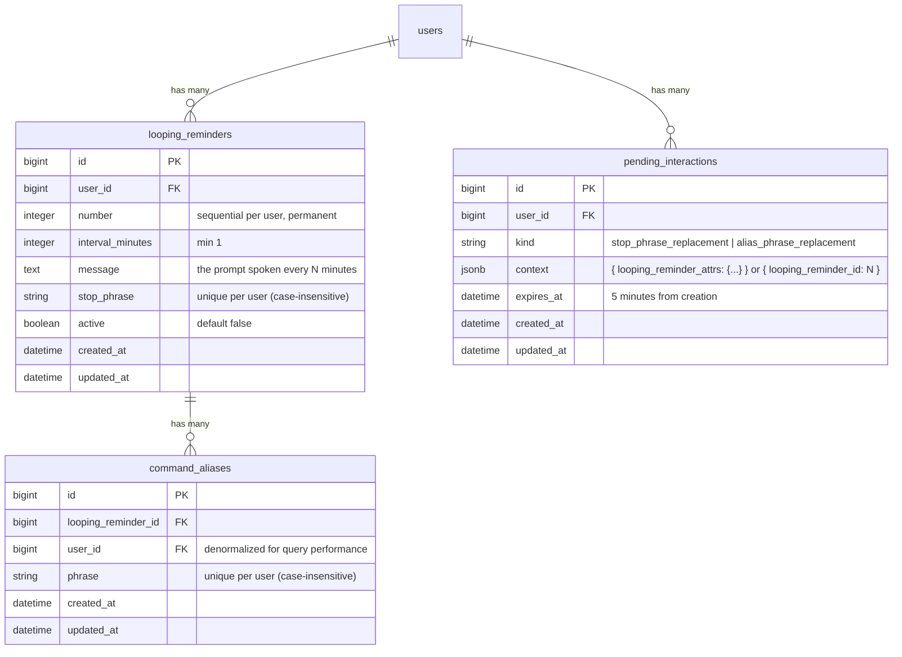

# feat: Add Looping Reminders

## Overview

Add a new category of schedulable item — the **looping reminder** — that fires every N minutes indefinitely until stopped by a voice stop phrase. Looping reminders are numbered, reusable (never deleted), and can be given voice aliases. They appear between Timers and Reminders on the main screen.

This feature introduces three new models (`LoopingReminder`, `CommandAlias`, `PendingInteraction`), four new intents, a pre-parser dispatcher service, and a chained Active Job — while keeping `CommandParser` stateless.

## Data Model



## Parsing Pipeline Order

The current single-step `CommandParser.parse(transcript)` call is replaced by a
`LoopingReminderDispatcher` service that runs these checks in order:

```
1. Expire stale PendingInteractions (expires_at < Time.current)
2. Check for active PendingInteraction for user
   → if found: treat transcript as replacement phrase (multi-turn path)
3. Scan active LoopingReminders for stop phrase (case-insensitive substring match)
   → if found: return { intent: :stop_loop, params: { looping_reminder_id: N } }
4. Scan CommandAliases for matching phrase (case-insensitive exact match)
   → if found: translate to { intent: :run_loop, params: { number: N } }
5. Delegate to CommandParser.parse(transcript) (unchanged, stateless)
```

`CommandParser` remains a pure string transformer with no knowledge of users or database state.

## Voice Response Strings

| Situation | Response |
|---|---|
| Create (success) | `"Created looping reminder 1, will ask 'have you done the dishes?' every 5 minutes until you reply 'doing the dishes'"` |
| Create (stop phrase collision) | `"Stop phrase already in use. Enter a different stop phrase?"` |
| Create (replacement phrase also taken) | `"Stop phrase also already in use. Try another, or say 'give up' to cancel."` |
| Run (success) | `"Running looping reminder 1"` |
| Run (already active) | `"Loop 1 already active"` |
| Run (not found) | `"Loop 1 not found"` |
| Stop phrase matched | `"Excellent. Stopping looping reminder 1"` |
| Alias create (success) | `"Alias 'remember the dishes' created for looping reminder 1"` |
| Alias create (phrase collision) | `"Alias phrase already in use. Enter a different phrase?"` |
| Alias create (replacement phrase also taken) | `"Alias phrase also already in use. Try another, or say 'give up' to cancel."` |
| User says "give up" during multi-turn | `"OK, giving up."` |

## Collision Rules

All phrase comparisons are **case-insensitive**. A phrase must be unique across all of:
- `looping_reminders.stop_phrase` (all loops for this user)
- `command_aliases.phrase` (all aliases for this user)

This prevents a stop phrase from accidentally matching an alias or vice versa.

## Phrase Matching

- **Stop phrases:** case-insensitive **substring** match (`transcript.downcase.include?(stop_phrase.downcase)`)
- **Alias phrases:** case-insensitive **exact** match (aliases are intentional commands)

## Implementation Phases

---

### Phase 1: Data Layer

#### 1a. Migrations

**`db/migrate/TIMESTAMP_create_looping_reminders.rb`**
```ruby
create_table :looping_reminders do |t|
  t.references :user, null: false, foreign_key: true
  t.integer    :number, null: false
  t.integer    :interval_minutes, null: false
  t.text       :message, null: false
  t.string     :stop_phrase, null: false
  t.boolean    :active, null: false, default: false
  t.timestamps
end
add_index :looping_reminders, [:user_id, :number], unique: true
add_index :looping_reminders, [:user_id, :stop_phrase], unique: true
```

**`db/migrate/TIMESTAMP_create_command_aliases.rb`**
```ruby
create_table :command_aliases do |t|
  t.references :looping_reminder, null: false, foreign_key: true
  t.references :user, null: false, foreign_key: true
  t.string     :phrase, null: false
  t.timestamps
end
add_index :command_aliases, [:user_id, :phrase], unique: true
```

**`db/migrate/TIMESTAMP_create_pending_interactions.rb`**
```ruby
create_table :pending_interactions do |t|
  t.references :user, null: false, foreign_key: true
  t.string     :kind, null: false
  t.jsonb      :context, null: false, default: {}
  t.datetime   :expires_at, null: false
  t.timestamps
end
add_index :pending_interactions, [:user_id, :kind]
```

**`db/migrate/TIMESTAMP_add_looping_reminder_intents_to_voice_commands.rb`**
Add `:create_loop`, `:run_loop`, `:alias_loop`, `:stop_loop`, `:give_up` to `VoiceCommand` intent enum.

#### 1b. Models

**`app/models/looping_reminder.rb`**
```ruby
class LoopingReminder < ApplicationRecord
  belongs_to :user
  has_many :command_aliases, dependent: :destroy

  validates :interval_minutes, numericality: { greater_than_or_equal_to: 1 }
  validates :message, presence: true
  validates :stop_phrase, presence: true
  validates :number, uniqueness: { scope: :user_id }

  scope :active_loops, -> { where(active: true) }

  def activate!
    update!(active: true)
  end

  def stop!
    update!(active: false)
  end

  def next_number_for(user)
    # Pessimistic lock to prevent race conditions on concurrent creation
    (user.looping_reminders.lock.maximum(:number) || 0) + 1
  end
end
```

**`app/models/command_alias.rb`**
```ruby
class CommandAlias < ApplicationRecord
  belongs_to :looping_reminder
  belongs_to :user

  validates :phrase, presence: true, uniqueness: { scope: :user_id, case_sensitive: false }
end
```

**`app/models/pending_interaction.rb`**
```ruby
class PendingInteraction < ApplicationRecord
  belongs_to :user

  KINDS = %w[stop_phrase_replacement alias_phrase_replacement].freeze
  validates :kind, inclusion: { in: KINDS }
  validates :expires_at, presence: true

  scope :active, -> { where("expires_at > ?", Time.current) }

  def self.for(user)
    where(user: user).active.order(created_at: :asc).first
  end
end
```

**`app/models/voice_command.rb`** — add to intent enum:
```ruby
create_loop: "create_loop",
run_loop:    "run_loop",
alias_loop:  "alias_loop",
stop_loop:   "stop_loop"
```

**`app/models/user.rb`** — add associations:
```ruby
has_many :looping_reminders, dependent: :destroy
has_many :command_aliases, dependent: :destroy
has_many :pending_interactions, dependent: :destroy
```

---

### Phase 2: Parser & Dispatcher

#### 2a. CommandParser — new intents

**`app/services/command_parser.rb`** — add three new `if` branches to `parse`:

```ruby
# "set a looping reminder for 5 minutes saying '...' until I say '...'"
if (m = normalized.match(/\blooping\s+reminder\s+for\s+(\d+)\s+minutes?\s+saying\s+'([^']+)'\s+until\s+I\s+say\s+'([^']+)'/i))
  return { intent: :create_loop,
           params: { interval_minutes: m[1].to_i, message: m[2].strip, stop_phrase: m[3].strip } }
end

# "run loop 1" / "run looping reminder 1"
if (m = normalized.match(/\brun\s+(?:loop|looping\s+reminder)\s+(\d+)/i))
  return { intent: :run_loop, params: { number: m[1].to_i } }
end

# "alias 'run loop 1' as 'remember the dishes'"
if (m = normalized.match(/\balias\s+'([^']+)'\s+as\s+'([^']+)'/i))
  return { intent: :alias_loop, params: { source: m[1].strip, target: m[2].strip } }
end
```

Note: The spoken-time normalization from `normalize_numbers` also runs for these transcripts, so number words like "five" in "for five minutes" must already be in `WORD_TO_NUMBER`. Verify coverage.

#### 2b. LoopingReminderDispatcher

**`app/services/looping_reminder_dispatcher.rb`**

```ruby
class LoopingReminderDispatcher
  def dispatch(transcript:, user:)
    clean_expired_interactions(user)

    pending = PendingInteraction.for(user)
    return handle_pending_interaction(pending, transcript, user) if pending

    if (loop = match_stop_phrase(transcript, user))
      return { intent: :stop_loop, params: { looping_reminder_id: loop.id } }
    end

    if (al = match_alias(transcript, user))
      return { intent: :run_loop, params: { number: al.looping_reminder.number } }
    end

    CommandParser.new.parse(transcript)
  end

  private

  def clean_expired_interactions(user)
    user.pending_interactions.where("expires_at <= ?", Time.current).destroy_all
  end

  def match_stop_phrase(transcript, user)
    user.looping_reminders.active_loops.find do |lr|
      transcript.downcase.include?(lr.stop_phrase.downcase)
    end
  end

  def match_alias(transcript, user)
    user.command_aliases.find { |al| al.phrase.casecmp?(transcript.strip) }
  end

  def handle_pending_interaction(pending, transcript, user)
    phrase = transcript.strip

    # Explicit cancellation
    if phrase.casecmp?("give up")
      pending.destroy
      return { intent: :give_up, params: {} }
    end

    # Phrase still taken — keep PendingInteraction alive, refresh TTL
    if phrase_taken?(phrase, user)
      pending.update!(expires_at: 5.minutes.from_now)
      return { intent: :unknown,
               params: { error: :replacement_phrase_taken, kind: pending.kind } }
    end

    # Phrase is free — complete the pending creation/alias
    context = pending.context.with_indifferent_access
    pending.destroy
    { intent: :complete_pending,
      params: context.merge(replacement_phrase: phrase, kind: pending.kind) }
  end

  def phrase_taken?(phrase, user)
    user.looping_reminders.where("LOWER(stop_phrase) = ?", phrase.downcase).exists? ||
      user.command_aliases.where("LOWER(phrase) = ?", phrase.downcase).exists?
  end
end
```

#### 2c. Update controllers

Both `VoiceCommandsController#create` and `Api::V1::TextCommandsController#create` currently call:
```ruby
command = CommandParser.new.parse(transcript)
```

Replace with:
```ruby
command = LoopingReminderDispatcher.new.dispatch(transcript: transcript, user: current_user)
```

---

### Phase 3: Responder & Job

#### 3a. CommandResponder — new intents

**`app/services/command_responder.rb`** — extend `response_text` and `respond`:

New `response_text` cases:
```ruby
when :create_loop
  loop = params[:looping_reminder]
  "Created looping reminder #{loop.number}, will ask '#{loop.message}' every " \
    "#{loop.interval_minutes} #{loop.interval_minutes == 1 ? 'minute' : 'minutes'} " \
    "until you reply '#{loop.stop_phrase}'"
when :run_loop
  loop = params[:looping_reminder]
  loop ? "Running looping reminder #{loop.number}" : "Loop #{params[:number]} not found"
when :run_loop_already_active
  "Loop #{params[:number]} already active"
when :stop_loop
  "Excellent. Stopping looping reminder #{params[:looping_reminder].number}"
when :alias_loop
  "Alias '#{params[:phrase]}' created for looping reminder #{params[:number]}"
when :stop_phrase_collision
  "Stop phrase already in use. Enter a different stop phrase?"
when :alias_collision
  "Alias phrase already in use. Enter a different phrase?"
when :replacement_phrase_taken
  "Could not create #{params[:kind] == 'alias_phrase_replacement' ? 'alias' : 'looping reminder'}, phrase already in use."
```

New `respond` logic (in addition to existing scheduling):
- `:create_loop` → validate stop phrase uniqueness; if taken, create PendingInteraction and return collision response; if unique, create LoopingReminder (active: true, next number), schedule LoopingReminderJob, Turbo Stream append
- `:run_loop` → find LoopingReminder by user + number; if active: return already-active response; if idle: activate, schedule job, Turbo Stream replace; if not found: return not-found response
- `:stop_loop` → find LoopingReminder by id; stop!, Turbo Stream replace
- `:alias_loop` → validate phrase uniqueness; if taken, create PendingInteraction and return collision response; if unique, create CommandAlias, Turbo Stream replace on loop row
- `:complete_pending` → complete the pending creation/alias with replacement phrase, proceed as normal create/alias path
- `:replacement_phrase_taken` → return the "could not create" response text (PendingInteraction already destroyed by dispatcher)

#### 3b. LoopingReminderJob

**`app/jobs/looping_reminder_job.rb`**

```ruby
class LoopingReminderJob < ApplicationJob
  queue_as :default
  discard_on StandardError

  def perform(looping_reminder_id, scheduled_fire_at)
    loop = LoopingReminder.find_by(id: looping_reminder_id)
    return unless loop&.active?

    audio_bytes = ElevenLabsClient.new.synthesize(loop.message)
    token = SecureRandom.hex
    Rails.cache.write(token, audio_bytes, expires_in: 5.minutes)
    Turbo::StreamsChannel.broadcast_append_to(
      loop.user,
      target: "voice_alerts",
      partial: "voice_alerts/alert",
      locals: { token: token }
    )

    next_fire_at = scheduled_fire_at + loop.interval_minutes.minutes
    LoopingReminderJob.set(wait_until: next_fire_at).perform_later(loop.id, next_fire_at)
  end
end
```

Note: `scheduled_fire_at` (not `Time.current`) is used to calculate the next fire to prevent interval drift from queue delays.

---

### Phase 4: UI

#### 4a. Main view

**`app/views/voice_commands/index.html.erb`** — add between timers and reminders sections:

```erb
<h2>Looping Reminders</h2>
<ul id="looping_reminders">
  <% if @looping_reminders.empty? %>
    <li>No looping reminders</li>
  <% else %>
    <%= render @looping_reminders %>
  <% end %>
</ul>
```

Load in controller: `@looping_reminders = current_user.looping_reminders.order(:number)`

#### 4b. Looping reminder partial

**`app/views/looping_reminders/_looping_reminder.html.erb`**

```erb
<li id="<%= dom_id(looping_reminder) %>">
  <span>
    <%= looping_reminder.number %>
    <% if looping_reminder.command_aliases.any? %>
      (<%= looping_reminder.command_aliases.map(&:phrase).join(", ") %>)
    <% end %>
    <% if looping_reminder.active? %>
      · active
    <% end %>
    · remind every <%= looping_reminder.interval_minutes %>
      <%= looping_reminder.interval_minutes == 1 ? "min" : "mins" %>
      '<%= looping_reminder.message %>'
      until '<%= looping_reminder.stop_phrase %>'
  </span>
</li>
```

#### 4c. Turbo Stream operations

| Trigger | Operation | Target |
|---|---|---|
| Loop created | `broadcast_append_to` user, target: `"looping_reminders"` | New `<li>` |
| Loop activated (`run loop N`) | `broadcast_replace_to` user, target: `dom_id(loop)` | Updated `<li>` |
| Loop stopped (stop phrase) | `broadcast_replace_to` user, target: `dom_id(loop)` | Updated `<li>` |
| Alias added | `broadcast_replace_to` user, target: `dom_id(loop)` | Updated `<li>` |

No `broadcast_before_to` insertion-order logic is needed for looping reminders since they are always appended in creation order (by number), and new loops always go at the end.

---

### Phase 5: API Parity

`Api::V1::TextCommandsController#create` uses the same dispatcher swap from Phase 2c. No additional changes needed — all new intents are handled by `CommandResponder` and the same `VoiceCommand` record creation applies.

---

## System-Wide Impact

### Interaction Graph

```
VoiceCommandsController#create
  → LoopingReminderDispatcher#dispatch
      → PendingInteraction check/cleanup
      → LoopingReminder stop phrase scan (DB read)
      → CommandAlias scan (DB read)
      → CommandParser#parse (stateless)
  → VoiceCommand.create! (status: received)
  → CommandResponder#respond
      → LoopingReminder.create! / activate! / stop! (DB write)
      → LoopingReminderJob.perform_later (enqueue)
      → Turbo::StreamsChannel.broadcast_* (WebSocket push)
      → PendingInteraction.create! (if collision)
  → VoiceCommand#update! (status: processed)

LoopingReminderJob#perform
  → LoopingReminder.find_by (DB read, checks active)
  → ElevenLabsClient#synthesize (external HTTP)
  → Rails.cache.write (cache write)
  → Turbo::StreamsChannel.broadcast_append_to (WebSocket push)
  → LoopingReminderJob.perform_later (re-enqueue self)
```

### Error & Failure Propagation

- `LoopingReminderJob` uses `discard_on StandardError` (same as `ReminderJob`). A failure silently breaks the chain — the loop goes silent until the user re-runs it.
- `PendingInteraction` conflicts and creation failures return graceful audio responses; no exceptions bubble to the controller.
- Stop phrase match failures (loop not found by id) should be guarded with `find_by` not `find`.

### State Lifecycle Risks

- **Race condition on number assignment:** Two simultaneous creation requests could get the same `number`. Guard with `LoopingReminder.lock.maximum(:number)` inside a transaction.
- **Double-activation race:** If two "run loop 1" commands arrive simultaneously, both could schedule a second job. Guard with a DB-level check: `find_by(number: N, active: false)` — only activate if currently idle.
- **Stale PendingInteraction:** Cleaned eagerly at the start of every dispatch call. No background job needed.
- **Job fires after stop:** The in-flight job checks `loop.active?` on execution. If the loop was stopped between enqueueing and execution, the job exits early without re-enqueuing. There is a small window (between job execution start and the active? check) but it is not a data-integrity risk — the worst case is one extra audio delivery.

### API Surface Parity

Both `VoiceCommandsController` and `Api::V1::TextCommandsController` must call `LoopingReminderDispatcher` — confirmed in Phase 2c. All four new intents are handled identically on both paths.

---

## Acceptance Criteria

### Functional

- [x] `"set a looping reminder for 5 minutes saying 'X' until I say 'Y'"` creates a LoopingReminder, immediately active, first fire in 5 minutes
- [x] Creation confirmation audio matches the template: "Created looping reminder N, will ask 'X' every N minutes until you reply 'Y'"
- [x] Stop phrase collision → "Stop phrase already in use. Enter a different stop phrase?" + PendingInteraction created
- [x] Next voice input after collision → replaces stop phrase if unique; if still taken, says "Stop phrase also already in use. Try another, or say 'give up' to cancel." and keeps PendingInteraction alive with refreshed 5-minute TTL
- [x] User can retry as many times as needed; TTL resets on each attempt
- [x] Saying "give up" during multi-turn → "OK, giving up." PendingInteraction destroyed, normal parsing resumes
- [x] PendingInteraction expires after 5 minutes of inactivity; subsequent input is parsed normally
- [x] `"run loop 1"` activates an idle loop and schedules the job
- [x] `"run loop 1"` on an already-active loop → "Loop 1 already active", no new job scheduled
- [x] `"run loop 99"` (nonexistent) → "Loop 99 not found"
- [x] Speaking the stop phrase (substring match, case-insensitive) stops the active loop
- [x] Stop confirmation: "Excellent. Stopping looping reminder N"
- [x] Stopped loop transitions to idle on screen (active indicator removed)
- [x] `LoopingReminderJob` fires audio every N minutes until loop is stopped
- [x] Stopping a loop mid-interval → next job exits early without re-enqueuing
- [x] `"alias 'run loop 1' as 'X'"` creates a CommandAlias; "X" subsequently activates loop 1
- [x] Multiple aliases per loop displayed comma-separated in parens
- [x] Alias phrase collision → same multi-turn pattern as stop phrase collision
- [x] Alias phrase must not collide with any existing stop phrase (and vice versa)
- [x] Looping Reminders section appears between Timers and Reminders on main screen
- [x] Display shows number, aliases (if any), active state, interval, message, stop phrase
- [x] All loops (idle and active) shown, ordered by number
- [x] Empty state: "No looping reminders"

### Quality Gates

- [x] All new models covered by unit specs (RSpec)
- [x] `LoopingReminderDispatcher` covered with integration specs (real DB, no mocks for the dispatch path)
- [x] `LoopingReminderJob` covered: active loop fires and re-enqueues; idle loop exits early
- [x] `CommandParser` specs for all three new intent regexes
- [x] `CommandResponder` specs for all new intents and collision paths
- [x] Mutation testing run against all new subjects; no non-equivalent survivors
- [x] RuboCop clean

---

## Dependencies & Risks

- **`WORD_TO_NUMBER` coverage:** The creation regex extracts the interval as a digit after normalization. Verify that number words used in "for N minutes" (e.g., "five", "ten") are in the dictionary. They are — coverage goes to 60, which is sufficient for reasonable loop intervals.
- **Single-user app:** Stop phrase uniqueness is scoped per user. The unique index on `(user_id, stop_phrase)` enforces this at the DB level. Case-insensitive uniqueness at DB level requires a functional index on `LOWER(stop_phrase)` — or enforce in the application layer only (simpler, acceptable for this use case).
- **PendingInteraction cleanup:** Stale interactions are cleaned synchronously at dispatch time. No cron job needed.

---

## Future Considerations (out of scope this cycle)

- Loop deletion from screen (like daily reminders)
- Alias deletion voice command: `"remove alias 'X'"`
- Server restart resilience: re-enqueueing active loops on boot
- Minimum/maximum interval enforcement beyond the 1-minute floor

---

## Sources & References

### Origin

- **Brainstorm:** [docs/brainstorms/2026-02-25-looping-reminders-brainstorm.md](../brainstorms/2026-02-25-looping-reminders-brainstorm.md)

  Key decisions carried forward:
  - New `LoopingReminder` model (not a new `kind` on `Reminder`)
  - `CommandAlias` model for multiple aliases per loop
  - `PendingInteraction` model for multi-turn collision flow
  - Creation immediately activates; server restart silently kills active loops

### Internal References

- Chained-job pattern: `app/jobs/reminder_job.rb` (daily reminder looping)
- Ordered Turbo Stream insertion: `docs/solutions/ui-bugs/turbo-streams-ordered-insertion-broadcast-before-to.md`
- Spoken-time parsing patterns: `docs/solutions/logic-errors/command-parser-spoken-time-parsing-bugs.md`
- Model display logic: `docs/solutions/logic-errors/day-label-logic-moved-from-erb-to-model-method.md`
- Existing parser: `app/services/command_parser.rb`
- Existing responder: `app/services/command_responder.rb`
- Existing job: `app/jobs/reminder_job.rb`
- Main view: `app/views/voice_commands/index.html.erb`
- Reminder partial: `app/views/reminders/_reminder.html.erb`
